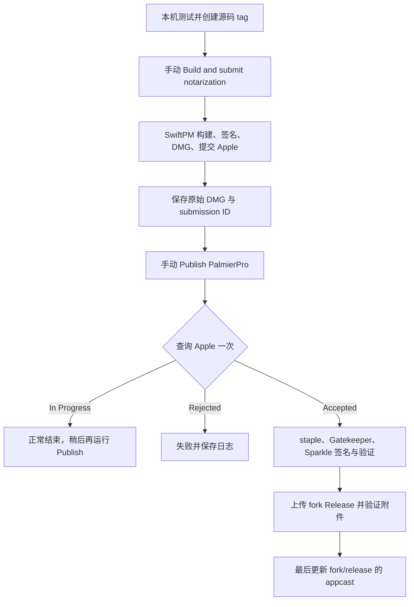

# Palmier Pro 打包、公证与发布

开发和发布自动化全部在私有仓库 `orca-studio/palmier-pro-dev` 的 `dev` 分支维护。日常测试在本机执行，两个 GitHub Actions 都只接受手动触发；推送代码或 tag 不会启动发布。

| 位置 | 职责 |
| --- | --- |
| `upstream/main` | 原作者代码，只拉取，不默认推送 |
| `fork/main` | 同步上游；本地 `main` 跟踪并推送这里 |
| `dev/dev` | 我们的源码、配置、测试、版本 tag 和发布自动化 |
| `fork/release` | 从 `fork/main` 切出，保留源码基线；后续仅提交发布物料，不合入开发源码或新增工作流、脚本 |
| fork GitHub Releases | 保存最终 DMG、manifest 和 SHA256SUMS，不把 DMG 提交到 Git |

Remote：`upstream` = `palmier-io/palmier-pro`，`fork` = `orca-studio/palmier-pro`，`dev` = `orca-studio/palmier-pro-dev`。fork 默认分支是 `release`，Actions 禁用。remote 和 push 设置是本地配置，新 checkout 需要重新设置。



## 应用身份和凭据

- Bundle ID：`ai.orca-studio.palmierpro`。
- Apple Team：`R2MFZSZP4R`；Developer ID：`Developer ID Application: zhen Wu (R2MFZSZP4R)`。
- macOS runner：Apple Silicon `xcode-27`，Xcode 27.0 build `27A266a`；分发 job 使用 `ubuntu-latest`。
- 使用 Palmier Pro 独立的 Sparkle 密钥；公钥位于 `Sources/PalmierPro/Resources/Info.plist`，本机私钥保存在 Keychain 的 `ai.orca-studio.palmierpro` account，并有 `.env` 备份。
- 非 sandbox 应用不再使用原作者的 provisioning profile 或 Keychain 共享 entitlement；Clerk 使用默认 Keychain 存储。

在开发仓库的 Repository Secrets/Variables 配置以下项目。工作流使用 `release` Environment，若使用 Environment 级配置，应允许 `dev` 分支运行。

| 类型 | 名称 | 内容 |
| --- | --- | --- |
| Variable | `APPLE_TEAM_ID` | `R2MFZSZP4R` |
| Secret | `APPLE_CERTIFICATE_P12_BASE64` | 含私钥的 Developer ID P12 的 Base64 |
| Secret | `APPLE_CERTIFICATE_PASSWORD` | P12 导出密码 |
| Secret | `APPLE_ID` | 有该 team 公证权限的 Apple ID |
| Secret | `APPLE_APP_SPECIFIC_PASSWORD` | Apple 专用密码 |
| Secret | `SPARKLE_PRIVATE_KEY` | Palmier Pro 专用 Sparkle 私钥 |
| Secret | `RELEASE_TOKEN` | 仅授权 `orca-studio/palmier-pro` 的 Contents read/write token |

Apple 证书和公证凭据可与 Compositor 共用；Sparkle 私钥和应用公钥必须配对。不要复用 Compositor 的 Sparkle 密钥，也不要随意轮换已分发版本的密钥。

`.env.example` 只列模板，真实 `.env` 必须被 Git 忽略且权限为 `0600`。不要把 `.env` 当 shell 脚本执行，不要输出凭据。

```sh
chmod 600 .env
python3 scripts/upload_release_secrets.py --check
python3 scripts/upload_release_secrets.py
```

上传脚本通过标准输入设置 Secrets，不打印值；未填写 `RELEASE_TOKEN` 时可以先上传其他凭据。token 可以由用户直接在开发仓库 Actions Secrets 中设置。

Clerk/Convex 配置和可选生产遥测不属于 Apple 签名凭据。账户服务需要在开发仓库配置 `CLERK_PUBLISHABLE_KEY`、`CONVEX_DEPLOYMENT_URL`、`CONVEX_HTTP_URL` Secrets，工作流将其写入应用；没有配置时账户及依赖账户的云端功能不可用。不要把原作者的生产凭据复制到 fork。应用身份或回调注册变化后的登录行为需要手动验证。

## 发布前验证和源码 tag

版本和构建号位于 `Sources/PalmierPro/Resources/Info.plist` 的 `CFBundleShortVersionString` 和 `CFBundleVersion`。tag 必须等于 `v` 加版本号，且属于 `dev` 历史；每次分发的构建号必须递增。

本机验证：

```sh
swift build
swift build --traits BundledSpeech
swift test
.build/release-tools-venv/bin/python -m unittest discover -s scripts/tests -v
actionlint
scripts/bundle.sh release --sign
```

Python 测试需要 `cryptography==46.0.3`，可在 `.build` 中创建独立 venv。签名构建包含全部可选 traits，验证 `.app` 内的字体、本地化、Metal/MLX、Sparkle、模型和 MCPB 资源。手动验证启动、项目打开/保存、登录（已配置后端时）及更新检查。

提交并推送开发变更后创建不可变源码 tag，以下版本仅为示例：

```sh
git push dev dev
git tag -a v0.7.7 -m 'Palmier Pro 0.7.7'
git push dev refs/tags/v0.7.7
```

不要移动 tag、推送全部 tag，或在下游发布开始后重新构建同一发布尝试。工作流代码来自选定的 `dev` commit，应用源码和依赖锁文件来自源码 tag，两者的 SHA 都记录在 manifest 中。

## 第一步：构建并提交公证

在开发仓库 Actions 选择 **Build and submit notarization**，branch 填 `dev`，`source_tag` 填已推送的源码 tag。

工作流通过 SwiftPM 和现有 `bundle.sh` 组装、Developer ID 签名应用，再生成并签名 DMG，提交 Apple 而不等待。原始 DMG 和 `release.json` 保存在 `palmierpro-pending-<run-id>-<attempt>` artifact，保留 14 天。保存 Build Run ID；任务成功只表示提交成功，不表示公证已接受。

```sh
gh workflow run release-build.yml --repo orca-studio/palmier-pro-dev --ref dev -f source_tag=v0.7.7
```

## 第二步：查询公证并发布

在开发仓库选择 **Publish PalmierPro**，branch 填 `dev`，`source_run_id` 填 Build Run ID；正常发布时 `resume_publish_run_id` 留空。可以提前在 `fork/release` 提交 `releases/<tag>/notes.md`。

macOS job 只查询 Apple 一次。`In Progress` 正常结束，分发 job 跳过，稍后再运行；拒绝则失败并保存日志。`Accepted` 后 staple 和验证同一 DMG，检查内嵌 app 的身份、版本、Gatekeeper 和公钥，生成最终字节的 Sparkle 签名并验证。

Linux job 自动继续，精确验证 Run ID、attempt、artifact ID、ZIP digest、源码 tag/SHA、文件 checksum/大小、签名及构建号。它只向 fork `release` 写入发布物料，打物料 tag，创建或恢复 Release 草稿，上传并下载验证 DMG、manifest 和 SHA256SUMS。Release 公开且匿名下载验证成功后，最后提交 appcast。

```sh
gh workflow run release-finalize.yml --repo orca-studio/palmier-pro-dev --ref dev -f source_run_id='<Build Run ID>'
```

开发 tag 标记源码；fork 的同名 tag 标记发布物料。manifest 保存完整源码 SHA、工作流 SHA/Run ID/attempt、Apple submission ID、原始和最终 hash、版本/构建号、大小、公钥与签名。

## 失败恢复

| 情况 | 处理 |
| --- | --- |
| Apple 仍在处理 | 稍后再次正常运行 Publish，不重新构建 |
| macOS finalization 失败 | 修复原因后正常运行 Publish；无成功最终 artifact 时不能恢复分发 |
| Linux 分发失败，脚本无需修改 | Re-run failed jobs，复用成功 macOS job 的最终产物 |
| 脚本已修复并推送到 dev | 新建 Publish，填写原 Build Run ID 及拥有成功 finalize job 的原 Publish Run ID |
| Artifact 过期或来源不匹配 | 停止恢复，处理版本冲突后重新规划构建，不能覆盖既有版本 |

```sh
gh workflow run release-finalize.yml --repo orca-studio/palmier-pro-dev --ref dev \
  -f source_run_id='<原 Build Run ID>' \
  -f resume_publish_run_id='<原 Publish Run ID>'
```

恢复模式跳过 macOS，只复用验证过的最终 artifact。两个 Action 共用并发锁。已存在的 manifest 和附件必须精确匹配；不会覆盖不同产物。查找 Release 时包含草稿，避免 GitHub by-tag 接口对草稿返回 404 的问题。

## 更新源和人工验证

```text
应用 → https://raw.githubusercontent.com/orca-studio/palmier-pro/release/appcast.xml
     → fork GitHub Release 最终 DMG → Sparkle 签名校验 → 安装
```

appcast 和下载附件必须公开可访问。已有上游应用不会自动改用新更新源；用户需要手动安装我们签名的新 Bundle ID 版本。项目文件类型保持 `io.palmier.project`，应用身份的变化不修改项目格式。首次发布只验证更新检查，下一版本才能证明跨版本升级。

人工验证：从公开 Release 下载并校验 SHA256SUMS，安装后启动，打开和保存临时项目，检查账号功能（已配置后端时）和更新检查。下一版本发布后，从上一版实际执行 Sparkle 更新并再次检查项目、登录和配置。

当前未触发 Palmier Pro 的打包、公证或发布 Action，没有首次发布记录。不要把 Compositor 的成功记录作为 Palmier Pro 的端到端验证。

## 本次配置验证

2026-10-07：`swift build`、`swift build --traits BundledSpeech`、`swift test`（1642 项）、Python 发布测试（22 项）、`actionlint`、shell 语法检查和 plist 校验均通过。`scripts/bundle.sh release --sign` 生成了完整 `.app`，已验证资源、Developer ID 深度签名、Team、Hardened Runtime 和时间戳；临时 DMG 的制作、签名及 Sparkle 签名验证也通过，测试 DMG 已清理。

构建仍有原有 Convex 二进制的 macOS 26.2 与应用最低版本 26.0 的链接警告。macOS 26.0 实机运行、人工安装/登录、Apple 公证和跨版本更新尚未验证；正式发布前按上述人工步骤完成验证。

参考：[Compositor 已验证的发布手册](https://github.com/orca-studio/Compositor-dev/blob/dev/docs/release-workflows.md)、[Sparkle 发布文档](https://sparkle-project.org/documentation/publishing/)。
